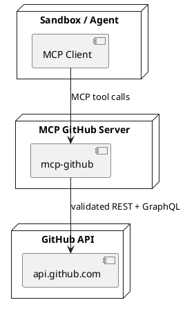

# MCP GitHub

Standalone MCP server for secure GitHub access from sandboxed agents. GitHub credentials are stored only on the MCP server side.

This repository is explicitly modeled after `mwaeckerlin/openclaw-mcp-gateway`:
- same standalone MCP gateway concept
- same strict validation and allowlist model
- same separation of server config, client config, and tool-call parameters
- same agent-facing README + SKILL approach

## Purpose and Security Model

Sandboxed agents should **not** hold GitHub tokens. Instead:

1. The sandboxed client calls this MCP server.
2. This MCP server (running outside the sandbox) uses the server-side `GITHUB_TOKEN`.
3. Calls are limited to validated MCP tools and validated arguments.

Security properties:
- no GitHub token in sandbox/client
- no arbitrary GitHub URL passthrough
- no freeform HTTP proxy tool
- schema-validated tool arguments
- bounded pagination (`per_page`, `first`, `last`, `limit`, `pageSize` are clamped to `1..100`)
- safe error shaping with token redaction

## Architecture / Deployment Context



## Exposed MCP Tools

### Discovery
- `github_rest_list_operations`: lists allowlisted GitHub OpenAPI operation IDs and their mapped family.

### REST tool families (full API coverage)
All GitHub REST operations from `@octokit/openapi` are mapped into one of these families:
- `github_repositories_rest`
- `github_branches_rest`
- `github_commits_rest`
- `github_git_data_rest`
- `github_pull_requests_rest`
- `github_issues_rest`
- `github_labels_milestones_rest`
- `github_releases_tags_rest`
- `github_actions_workflows_rest`
- `github_checks_status_rest`
- `github_discussions_projects_rest`
- `github_users_orgs_teams_rest`
- `github_search_rest`
- `github_notifications_reactions_rest`
- `github_webhooks_deployments_rest`
- `github_codespaces_rest`
- `github_rest_misc`

Each REST family tool takes:
- `operationId` (required, must belong to that family)
- `parameters` (validated object; pagination bounded)

### GraphQL
- `github_graphql`: validated GraphQL operation execution (`operationName`, `query`, optional `variables`) for gaps where GraphQL is needed.

## Tool-Call Parameters

### `github_rest_list_operations`
```json
{ "family": "github_pull_requests_rest", "limit": 50, "offset": 0 }
```

### Any `*_rest` family tool
```json
{
  "operationId": "pulls/list",
  "parameters": {
    "owner": "mwaeckerlin",
    "repo": "mcp-github",
    "state": "open",
    "per_page": 30
  }
}
```

### `github_graphql`
```json
{
  "operationName": "Viewer",
  "query": "query Viewer { viewer { login } }",
  "variables": {}
}
```

## Configuration

> Production rule: keep `GITHUB_TOKEN` server-side only.

### Server configuration (MCP GitHub server process)

| Variable | Required | Description |
|---|---|---|
| `GITHUB_TOKEN` | yes | GitHub token used by the server (never passed to sandbox) |
| `MCP_GITHUB_HOST` | no | Bind host (default `0.0.0.0`) |
| `MCP_GITHUB_PORT` | no | Bind port (default `4000`) |
| `DISABLE_TOOLS` | no | Comma-separated MCP tool names to disable |

### Client configuration (sandbox/agent environment)

| Variable | Required | Description |
|---|---|---|
| `MCP_GITHUB_URL` | yes | URL where the sandbox MCP client reaches this server (for example `http://mcp-github:4000`) |

### Separation rules

- **Server configuration** controls auth and exposed tools.
- **Client configuration** only tells the sandbox where MCP lives.
- **Tool-call parameters** are per-invocation validated `arguments` and cannot override server auth/config.

## Installation and Usage

```bash
npm install
npm run build
GITHUB_TOKEN=*** npm start
```

Dev mode:
```bash
GITHUB_TOKEN=*** npm run dev
```

Tests:
```bash
npm test
```

## Safe Usage Rules

- Always choose a scoped family tool; do not try to emulate arbitrary HTTP.
- Use `github_rest_list_operations` to discover valid operation IDs.
- Keep pagination bounded and intentional.
- Do not put secrets into tool arguments.
- Prefer REST operation IDs first; use GraphQL only when needed.

## Troubleshooting

| Symptom | Cause | Action |
|---|---|---|
| `GITHUB_TOKEN is required` | Missing server token | Set server-side `GITHUB_TOKEN` |
| `operationId ... is not allowlisted for tool ...` | Wrong tool family | Query `github_rest_list_operations` and use matching family |
| `GitHub authentication or permission error (401/403)` | Invalid token or insufficient scopes | Rotate token or add required scopes |
| `GitHub resource not found or not accessible` | Missing permission or wrong resource | Validate owner/repo/resource access |
| `Tool disabled by DISABLE_TOOLS` | Tool explicitly disabled | Remove from `DISABLE_TOOLS` or call different tool |

## SKILL

This repository ships `SKILL.md` for local OpenClaw skill installation and agent-first operating guidance.
