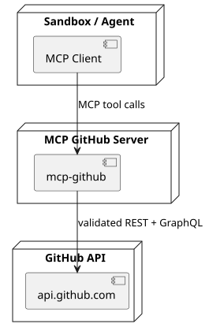
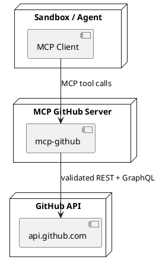

# MCP GitHub

Standalone MCP server for secure GitHub access from sandboxed agents. GitHub credentials are stored only on the MCP server side.

This repository is explicitly modeled after `mwaeckerlin/openclaw-mcp-gateway`:
- same standalone MCP gateway concept
- same strict validation and allowlist model
- same separation of server config, client config, and tool-call parameters
- same agent-facing README + SKILL approach

## Purpose and Security Model

Sandboxed agents should **not** hold GitHub tokens. Instead:

1. The sandboxed client calls this MCP server.
2. This MCP server (running outside the sandbox) uses the server-side `GITHUB_TOKEN`.
3. Calls are limited to validated MCP tools and validated arguments.

The agent does not need a GitHub token. The token is required only on the MCP server side.

Security properties:
- no GitHub token in sandbox/client
- no arbitrary GitHub URL passthrough
- no freeform HTTP proxy tool
- schema-validated tool arguments
- bounded pagination (`per_page`, `first`, `last`, `limit`, `pageSize` are clamped to `1..100`)
- safe error shaping with token redaction

## Architecture / Deployment Context



<details>
<summary>PlantUML source</summary>



</details>

## Exposed MCP Tools

### Discovery
- `github_rest_list_operations`: lists allowlisted GitHub OpenAPI operation IDs and their mapped family.

### REST tool families (full API coverage)
All GitHub REST operations from `@octokit/openapi` are mapped into one of these families:
- `github_repositories_rest`
- `github_branches_rest`
- `github_commits_rest`
- `github_git_data_rest`
- `github_pull_requests_rest`
- `github_issues_rest`
- `github_labels_milestones_rest`
- `github_releases_tags_rest`
- `github_actions_workflows_rest`
- `github_checks_status_rest`
- `github_discussions_projects_rest`
- `github_users_orgs_teams_rest`
- `github_search_rest`
- `github_notifications_reactions_rest`
- `github_webhooks_deployments_rest`
- `github_codespaces_rest`
- `github_rest_misc`

Each REST family tool takes:
- `operationId` (required, must belong to that family)
- `parameters` (validated object; pagination bounded)

### GraphQL
- `github_graphql`: validated GraphQL operation execution (`operationName`, `query`, optional `variables`) for gaps where GraphQL is needed.

### Copilot cloud agent
- `github_copilot_assign_issue`: assign GitHub Copilot cloud agent to an existing issue. Copilot researches the issue, creates an implementation plan, and opens a pull request. Accepts optional `agent_assignment` for `target_repo`, `base_branch`, `custom_instructions`, `custom_agent`, and `model`. Requires a Copilot plan with cloud agent enabled (public preview).

## Tool-Call Parameters

### `github_rest_list_operations`
```json
{ "family": "github_pull_requests_rest", "limit": 50, "offset": 0 }
```

### Any `*_rest` family tool
```json
{
  "operationId": "pulls/list",
  "parameters": {
    "owner": "mwaeckerlin",
    "repo": "mcp-github",
    "state": "open",
    "per_page": 30
  }
}
```

### `github_graphql`
```json
{
  "operationName": "Viewer",
  "query": "query Viewer { viewer { login } }",
  "variables": {}
}
```

## How To Use Through MCP

Use this sequence for reliable MCP usage from an agent.

### 1) Check server readiness

- Call `GET /healthz`.
- If `status` is `degraded`, continue in read-only mode: only public read calls are expected to work.

### 2) Discover the exact operationId

Call tool `github_rest_list_operations` with:

```json
{
  "family": "github_issues_rest",
  "limit": 200,
  "offset": 0
}
```

Then choose the operation ID you need from `operations[]`.
For creating issues, this is typically `issues/create`.
Each operation item also includes `method`, `path`, and `parameterNames` so users can see which route/query/body names are expected before calling the family tool.

### Where all parameters come from

For each REST call, parameters are discovered and validated using this chain:

1. `github_rest_list_operations` gives the exact `operationId` plus `method`, `path`, and `parameterNames`.
2. `parameterNames` are taken from GitHub OpenAPI metadata embedded via `@octokit/openapi`.
3. You pass these fields under `parameters` in the matching `*_rest` family tool.
4. The server enforces family allowlisting (`operationId` must belong to that tool family).

Practical guidance:

- Start with `github_rest_list_operations` and filter by family.
- Pick the target operation (`issues/create`, `issues/create-comment`, `pulls/create`, and so on).
- Use the returned `parameterNames` as your parameter checklist.
- If unsure about optional vs required fields for that operation, verify against the GitHub REST endpoint docs for the same operation ID and path.

### 3) Execute the family tool with validated parameters

To create a new issue in `mwaeckerlin/mcp-github`, call tool `github_issues_rest`:

```json
{
  "operationId": "issues/create",
  "parameters": {
    "owner": "mwaeckerlin",
    "repo": "mcp-github",
    "title": "Example issue via MCP",
    "body": "Created through mcp-github using github_issues_rest.",
    "labels": ["bug"]
  }
}
```

Expected behavior:

- Success returns JSON containing GitHub API response data for the created issue.
- If token or permissions are missing, you get a clear error (`GitHub token is not configured...` or `authentication or permission error`).
- If operation/family mismatch occurs, you get an allowlist validation error.

### 4) Verify by listing issues

Call tool `github_issues_rest`:

```json
{
  "operationId": "issues/list-for-repo",
  "parameters": {
    "owner": "mwaeckerlin",
    "repo": "mcp-github",
    "state": "open",
    "per_page": 30
  }
}
```

## Practical MCP Recipes

### Read current authenticated account

Tool: `github_users_orgs_teams_rest`

```json
{
  "operationId": "users/get-authenticated",
  "parameters": {}
}
```

### Comment on an issue

Tool: `github_issues_rest`

```json
{
  "operationId": "issues/create-comment",
  "parameters": {
    "owner": "mwaeckerlin",
    "repo": "mcp-github",
    "issue_number": 1,
    "body": "Comment added via MCP"
  }
}
```

### Open a pull request

Tool: `github_pull_requests_rest`

```json
{
  "operationId": "pulls/create",
  "parameters": {
    "owner": "mwaeckerlin",
    "repo": "mcp-github",
    "title": "Example PR via MCP",
    "head": "feature-branch",
    "base": "main",
    "body": "Created through mcp-github"
  }
}
```

## Configuration

> Production rule: keep `GITHUB_TOKEN` server-side only.

### Server configuration (MCP GitHub server process)

| Variable | Required | Description |
|---|---|---|
| `GITHUB_TOKEN` | no | GitHub token used by the server (never passed to sandbox); if missing, server starts in degraded mode: public read calls can work, while private and write operations fail |
| `MCP_AUTH_TOKEN` | no | Shared secret token for MCP endpoint authentication; if set, all MCP requests must supply this token via `Authorization: Bearer <token>` header or `?token=<token>` query parameter; `/healthz` is exempt |
| `MCP_GITHUB_HOST` | no | Bind host (default `0.0.0.0`) |
| `MCP_GITHUB_PORT` | no | Bind port (default `4000`) |
| `DISABLE_TOOLS` | no | Comma-separated MCP tool names to disable |

### Authentication setup (MCP_AUTH_TOKEN)

When `MCP_AUTH_TOKEN` is set on the server, the sandbox must present the same token in every MCP request. The `/healthz` endpoint is not protected and can always be polled for readiness.

**Server side** — set the shared secret:
```bash
export MCP_AUTH_TOKEN=$(openssl rand -hex 32)
```

**Client side** — pass the token via HTTP header (recommended):
```
Authorization: Bearer <token>
```

Or via query parameter (alternative):
```
http://mcp-github:4000/?token=<token>
```

**Client environment variable** — expose the token to the sandbox:

| Variable | Required | Description |
|---|---|---|
| `MCP_AUTH_TOKEN` | no | Shared secret that the sandbox must present when `MCP_AUTH_TOKEN` is also set on the server |

**Security considerations:**
- Generate tokens with a cryptographically secure random source (e.g., `openssl rand -hex 32`).
- Rotate tokens periodically and whenever they may have been exposed.
- Never commit tokens to source control.
- Keep the token length ≥ 32 characters to resist brute-force attempts.
- Without `MCP_AUTH_TOKEN` set, the server accepts all requests (backward-compatible default).

### Health status semantics

- `GET /healthz` always returns HTTP `200` while the process is running (authentication is not required for this endpoint).
- With token configured: `{ "ok": true, "status": "ready", "githubTokenConfigured": true }`
- Without token: `{ "ok": true, "status": "degraded", "githubTokenConfigured": false, "message": "...set GITHUB_TOKEN..." }`
- In degraded mode, `github_rest_list_operations` still works and is filtered to read-only (`GET`/`HEAD`) operations; public read calls can work, while write/private operations fail.

### Client configuration (sandbox/agent environment)

| Variable | Required | Description |
|---|---|---|
| `MCP_GITHUB_URL` | yes | URL where the sandbox MCP client reaches this server (for example `http://mcp-github:4000`) |
| `MCP_AUTH_TOKEN` | no | Shared secret to present in MCP requests when the server requires authentication |

`MCP_GITHUB_URL` must be set by your deployment/startup configuration and exposed in the sandbox user environment, because the MCP client reads this variable to know where to send requests.

### Separation rules

- **Server configuration** controls auth and exposed tools.
- **Client configuration** only tells the sandbox where MCP lives.
- **Tool-call parameters** are per-invocation validated `arguments` and cannot override server auth/config.

## Test Token Requirements and Risks

### Required `GITHUB_E2E_TOKEN` permissions

Run the E2E test suite with:

```bash
export GITHUB_E2E_TOKEN=ghp_...
cd test && docker compose up
```

The token is set server-side only (`GITHUB_TOKEN` in the `mcp-github` container). The `test-client` container never sees it.

#### Fine-grained Personal Access Token (recommended)

Create a fine-grained PAT at <https://github.com/settings/tokens?type=beta>.
See the [GitHub fine-grained PAT permission reference](https://docs.github.com/en/rest/authentication/permissions-required-for-fine-grained-personal-access-tokens) for the full list.

**Repository access:** Select *"All repositories"* or *"Public Repositories"* — all repository tests access public repos (`octocat/Hello-World`, `mwaeckerlin/mcp-github`), which the GitHub API allows with no repository permission at all.

**No permissions are required** for the E2E tests with a "Public repositories" fine-grained token:
- `users/get-authenticated` and GraphQL `viewer { login }`: *"The fine-grained token does not require any permissions"* ([GitHub docs](https://docs.github.com/en/rest/users/users#get-the-authenticated-user--fine-grained-access-tokens)).
- All repository/branch/commit/issue/PR/release/action/search tests access only public repos (`octocat/Hello-World`, `mwaeckerlin/mcp-github`) and the public `github` org — no permissions required per GitHub's API.
- The codespaces test (`GET /user/codespaces`) **gracefully skips** (passes) when the token lacks the "Codespaces" repository permission. To fully run it, select *"All repositories"* access and add the "Codespaces" repository permission (read) — this appears under **Repository permissions** in the GitHub UI (not Account permissions), and has nothing to do with secrets.

> **Note on "Codespaces user secrets":** This is an *Account* permission about secrets stored inside codespaces. It is a completely different thing from the *Repository* permission "Codespaces" and is not needed here.

#### Classic Personal Access Token

If you use a classic PAT (legacy), no scopes are needed for the basic tests. Add the `codespace` scope only if you want the codespaces test to run fully.

> **Note:** GitHub's API returns HTTP 401 if you supply *any* token that is invalid or expired, even for public-data endpoints. Always use a fresh, valid token.

### Required token permissions for write workflows in public repositories

These permissions apply when the agent should perform write actions (branch, commit/push, issues, PRs) through this MCP server.

#### Fine-grained PAT (recommended)

Repository access:
- Target repository (or "All repositories") where writes should happen

Repository permissions:
- `Contents: Read and write` (checkout via API, create branch, commit, push)
- `Issues: Read and write` (create/update issue)
- `Pull requests: Read and write` (create/update PR)

Optional (only if needed):
- `Workflows: Read and write` (required when commits modify `.github/workflows/*`)

#### Classic PAT

Minimum for public repositories:
- `public_repo`

Optional (only if needed):
- `workflow` (required when pushing/modifying `.github/workflows/*`)

Notes:
- For pure checkout of a public repository, no token is required.
- Write operations still require normal GitHub repository access (for example collaborator/team rights).

### What the tests do to your GitHub account

**All E2E tests are strictly read-only.** They only call `GET` endpoints. No data is created, modified, or deleted. Specifically:

- No repositories, issues, PRs, or comments are created.
- No webhooks, deployments, or labels are written.
- No organization settings are changed.
- No starred repos, notifications, or subscriptions are altered.
- Codespace listing only reads; no codespace is started or stopped.
- Rate-limit info is read (counts against your API quota but does not change any resource).

**Risk assessment:** There is no risk of data loss or unintended side-effects regardless of what permissions your token carries. Even a token with full write permissions will not cause any mutations because the tests only use read operations.

## Installation and Usage

```bash
npm install
npm run build
npm start
```

Dev mode:
```bash
npm run dev
```

Tests:
```bash
npm test
```

## Safe Usage Rules

- Always choose a scoped family tool; do not try to emulate arbitrary HTTP.
- Use `github_rest_list_operations` to discover valid operation IDs.
- Keep pagination bounded and intentional.
- Do not put secrets into tool arguments.
- Prefer REST operation IDs first; use GraphQL only when needed.

## Troubleshooting

| Symptom | Cause | Action |
|---|---|---|
| `GitHub token is not configured on the MCP server ...` | Server started without token | Set server-side `GITHUB_TOKEN` to enable GitHub REST/GraphQL execution tools |
| `operationId ... is not allowlisted for tool ...` | Wrong tool family | Query `github_rest_list_operations` and use matching family |
| `GitHub authentication or permission error (401/403)` | Invalid token or insufficient scopes | Rotate token or add required scopes |
| `GitHub resource not found or not accessible` | Missing permission or wrong resource | Validate owner/repo/resource access |
| `Tool disabled by DISABLE_TOOLS` | Tool explicitly disabled | Remove from `DISABLE_TOOLS` or call different tool |
| `GitHub API error (422)` with assignees | Wrong assignee username or missing `agent_assignment` | Use the dedicated `github_copilot_assign_issue` tool |

### Assigning Copilot cloud agent to issues

Use the dedicated `github_copilot_assign_issue` tool to assign GitHub Copilot cloud agent to an existing issue. Copilot will research the issue, create an implementation plan, make code changes on a branch, and open a pull request.

Requires a Copilot plan (Pro, Pro+, Business, or Enterprise) with cloud agent enabled in the repository. This feature is in **public preview**.

**Why not use `issues/add-assignees` directly?** The REST API requires the assignee `"copilot-swe-agent[bot]"` (including the `[bot]` suffix) and an `agent_assignment` body object. The `github_copilot_assign_issue` tool handles this automatically.

Minimal call:

```json
{
  "owner": "octo-org",
  "repo": "octo-repo",
  "issue_number": 42
}
```

With optional configuration:

```json
{
  "owner": "octo-org",
  "repo": "octo-repo",
  "issue_number": 42,
  "agent_assignment": {
    "base_branch": "main",
    "custom_instructions": "Add unit tests only. Do not modify existing logic.",
    "model": "gpt-4o"
  }
}
```

## SKILL

This repository ships `SKILL.md` for local OpenClaw skill installation and agent-first operating guidance.
